1. Открыть проект по ссылке: https://oshwlab.com/olukelo/btn8982-three-phase-controller_copy_copy_copy

2. Пролистнуть  страницу до изображения платы и нажать "Open in editor"

   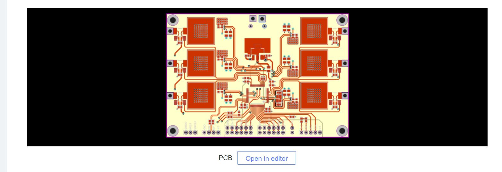

3.  В открывшемся редакторе печатной платы нам необходимо выгрузить на компьютер 3 файла: gerber-файл для изготовления платы, BOM-файл для подбора компонентов платы  и файл позиционирования - для монтажа компонентов на плату.

      3.1. Выгрузка gerber-файла: Пункты меню <Файл> <Создать GERBER>, Далее отвечаем "Да" на вопрос о проверке правил разработки плат.  В следующем открывшемся окне не надо менять никакие значения полей (можно попробовать получить купон со скидкой, но мы это не будем рассматривать). Необходимо нажать кнопку <Generate GERBER> и сохранить получившийся файл на диск.

      3.2. Выгрузка BOM-файла: Аналогично пункты меню <Файл> <Экспорт BOM>. В открывшемся окне ничего не меняем и нажимаем <Экспорт BOM>, и выбираем место на диске, где хотим его сохранить. Закрываем окно редактирования BOM-файла.

      3.3. Выгрузка файла координации: Пункты меню <Файл> <Экспортировать файл координации>.  В следующем окне не ставим никаких галочек и нажимаем кнопку <Экспорт>. Выбираем место для сохранения файла.

4. Далее переходим непосредственно к заказу. На сайт https://jlcpcb.com/ можно перейти сразу из окна редактора. Пункты меню <Fabrication> <PCB Order>.

2. На сайте можно авторизоваться через Google аккаунт, либо завести свой аккаунт на сайте. Авторизуемся на сайте. (Правый верхний угол, кнопка <Sign in> ).

3. Нажимаем кнопку <Quote now>  (Можно не обращать на значения полей выше кнопки, необходимые значения потом будут получены из GERBER-файла)

   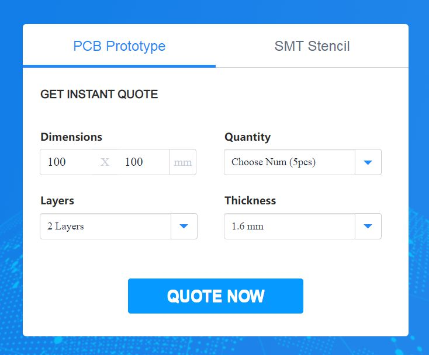

4. В следующем окне нажимаем кнопку <Add gerber fitle> Выбираем файл созданный на этапе 3.1. После подгрузки файла на странице появятся изображения обеих сторон платы и поля ниже примут значения нашей платы. Если вам не принципиально, все поля ниже можно оставить по умолчанию, Поле PCB Qty - количество заказываемых плат.

5. Проматываем ниже и активируем купон на бесплатную сборку платы:

   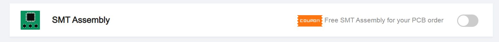

   

6. Оставляем выбранной левую (переднюю) сторону платы с микропроцессором. И ниже оставляем указание на то, что мы хотим собрать все 5 плат. Нажимаем <Confirm>.

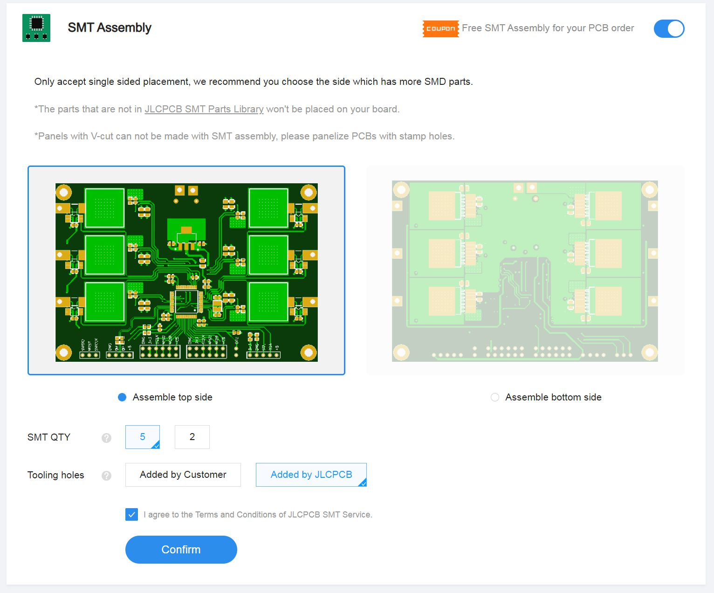

10. В следующем окне нажимаем кнопку <Add BOM File>, указываем местоположение BOM-файла, полученного на этапе 3.2. Далее Нажимаем кнопку <Add CPL file>, и указываем местоположение файла координации, полученного на этапе 3.3. Если вдруг вы забыли, где какой файл, то имя BOM-файл по умолчанию начинается с этих же букв (BOM), а имя файла координации начинается с PickAndPlace.

    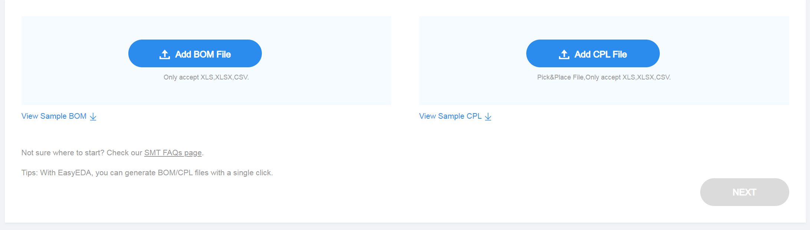

    Далее нажимаем Next:

    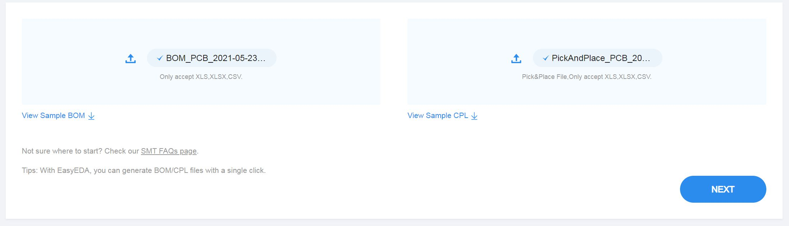

11. После этого проверяется наличие компонентов на складе и вам выдается в виде таблицы: 

    Как видите, все в наличии и будет установлено, кроме AD8417BRMZ, но поскольку использование этих измерителей тока на данный момент не поддерживается прошивкой, их монтаж можно не производит. Если они есть в наличии, и вы хотите отказаться от их монтажа, достаточно снять галочку напротив этой позиции. По окончании выбора компонентов, нажать кнопку <NEXT> (в самом низу, нужно промотать список)

12. В следующем окне проматываем до конца и убеждаемся, что монтажу не подлежат измерители тока, контроллеры двигателей и два вида конденсаторов:

    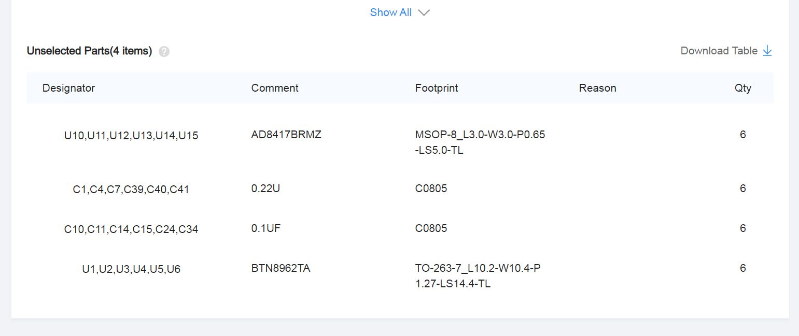

    Еще раз напомню, что измерители тока (AD8417BRMZ) не распаиваем, потому, что на данный момент они не поддерживаются прошивкой. Остальные компоненты находятся на тыловой стороне и скидку на из монтаж мы не получим. Конденсаторы не обязательны для устойчивой работы контроллера, а контроллеры двигателей BTN8962TA придется закупить и припаять самостоятельно, после получения платы.

13. Нажимаем <Save to Cart> на поле справа от списка компонентов (цена может отличаться, в зависимости от изменения рыночной стоимости компонентов):

    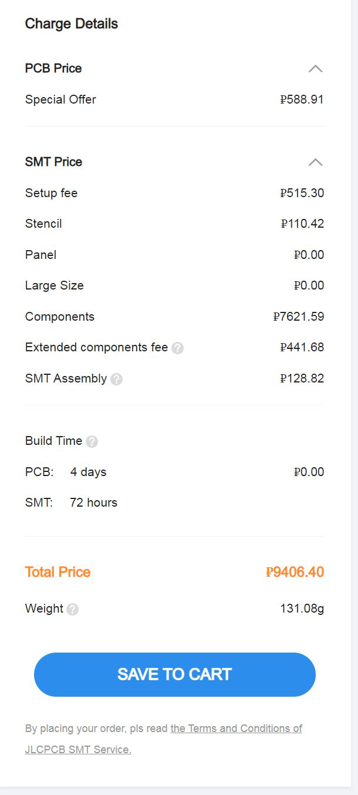

14. В следующем окне нажимаем <Secure Checkout>:

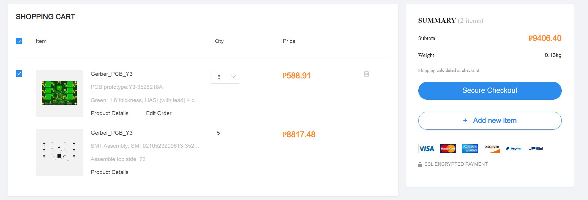

15 .В Следующем окне, вам требуется ввести адрес доставки, выбрать способ доставки , и оплатить заказ. 

16. Вы получили платы. Что делать дальше? Необходимо купить контроллеры двигателя BTN8962TA 

BTN8982 или BTN8962 (Первые расчитаны на более высокий ток, вторые дешевле). и распаять из на плату, как на рисунке:

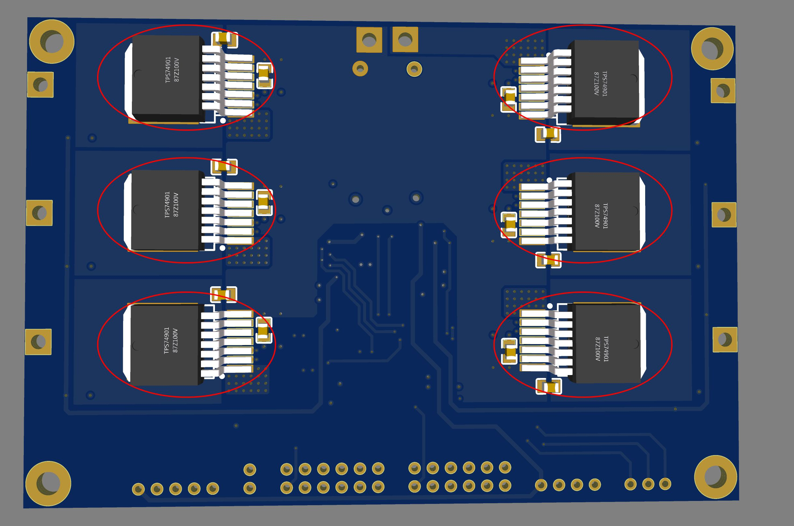

Приобрести оребренные радиаторы 15*15 мм, (или обрезать радиаторы большего размера): И наклеить их на термоклей или теплопроводящую прокладку в квадраты на обратной стороне платы:

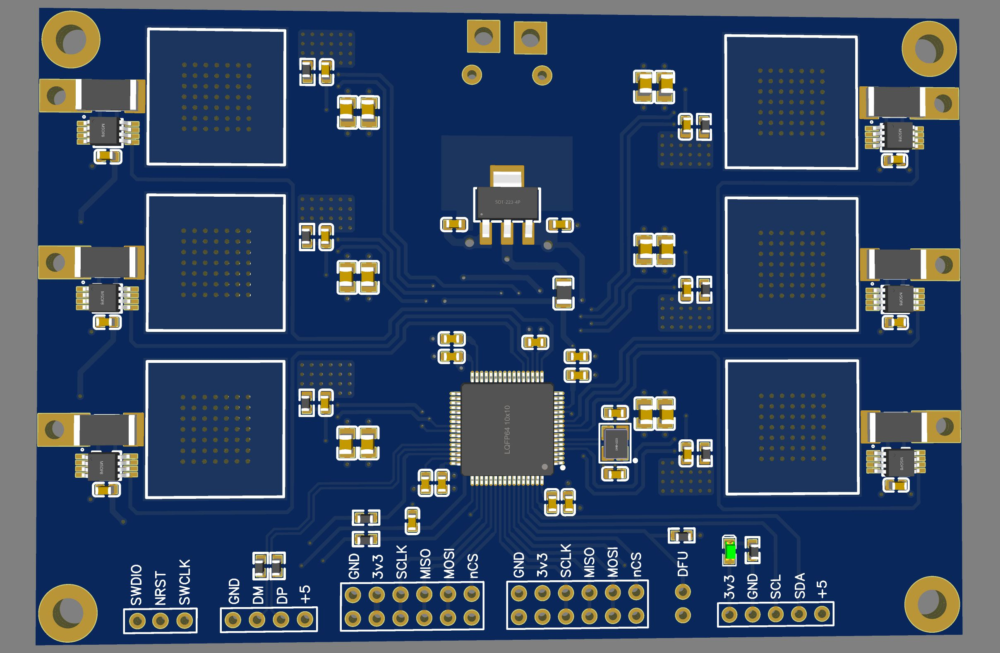

Приобрести штыревые разъемы, например, PLS 2.54 мм для программатора, USB, и I2C датчиков, и PLD 2.54 мм -  для SPI устройств. Распаять их в соответствующие места платы, обведенные белыми прямоугольниками.  (На картинке выше, внизу). Перейти к прошивке платы.
